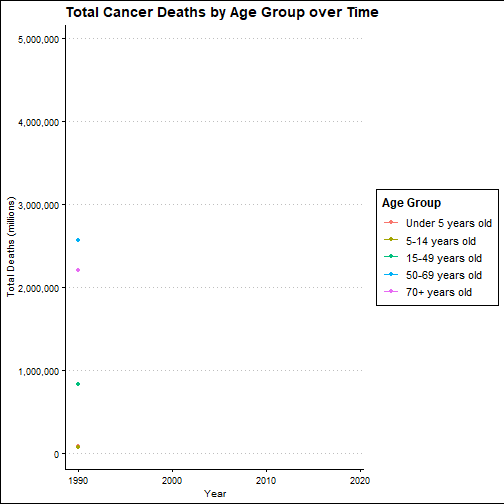

```{r setup, include=FALSE}
knitr::opts_chunk$set(echo = FALSE, 
                      cache=FALSE, 
                      message=FALSE, 
                      warning=FALSE,
                      include=FALSE,
                      options(htmltools.dir.version = FALSE))
```


```{r libraries, message = FALSE, warning = FALSE, eval = TRUE, echo = FALSE}
library(ggplot2)
library(knitr)
library(tidyverse)
library(ggthemes)
library(kableExtra)
library(here)
library(rmarkdown)
library(knitr)
library(readr)
library(dplyr)
library(sf)
library(ggrepel)
library(stringr)
library(scales)
library(knitr)
library(broom)
library(gganimate)
library(gifski)
library(png)
library(xaringanExtra)
```


# Introduction 


.content-box-soft[ 
- Cancer is a complex and diverse group of diseases that can affect anyone, regardless of age, gender, lifestyle, or background. 
]


.content-box-soft[ 
- Cancer occurs when normal cells in the body start to grow and divide uncontrollably, forming a mass or tumor. 
]

.content-box-soft[ 
- The treatment of cancer has garnered the attention and investments of numerous nations to come together and pool in resources along with their medical expertise to combat this deadly disease.
]

.content-box-soft[ 
- Cancer is a significant public health challenge affecting millions of people worldwide and is a leading cause of death globally. In this presentation, we will discuss the different types of cancer, their causes, symptoms, and treatment options, and the current state of cancer research and treatment.
]


```{r add_image,include=TRUE,out.width="70%",fig.align='center'}
knitr::include_graphics("figs/image1.jpg")
```

---

# Cancer by Age

```{r reading data, message = FALSE, warning = FALSE, eval = TRUE, echo = FALSE}

cancer_age <- read_csv(here::here("data/cancer-death-rates-by-age.csv"))

cancer_time <- read_csv(here::here("data/cancer-deaths-by-age-timetrend.csv"))

```

```{r tableref, include=TRUE, message = FALSE, warning = FALSE, eval = TRUE, echo = FALSE, fig.height = 4, fig.width = 4}

cancer_age_2019 <- cancer_age %>% 
  rename(Country = Entity,
         "Under 5 years old" = "Deaths - Neoplasms - Sex: Both - Age: Under 5 (Rate)",
         "5-14 years old" = "Deaths - Neoplasms - Sex: Both - Age: 5-14 years (Rate)",
         "15-49 years old" = "Deaths - Neoplasms - Sex: Both - Age: 15-49 years (Rate)",
         "50-69 years old" = "Deaths - Neoplasms - Sex: Both - Age: 50-69 years (Rate)",
         "70+ years old" = "Deaths - Neoplasms - Sex: Both - Age: 70+ years (Rate)") %>%
  filter(Year == 2019,
         !is.na(Code),
         Country != "World")

new_col_order <- c("Country", "Code", "Year",
                   "Under 5 years old", 
                   "5-14 years old", 
                   "15-49 years old",
                   "50-69 years old",
                   "70+ years old",
                   "Deaths - Neoplasms - Sex: Both - Age: Age-standardized (Rate)",
                   "Deaths - Neoplasms - Sex: Both - Age: All Ages (Rate)"
                   )

cancer_age_2019 <- cancer_age_2019[, new_col_order]

mean_death_rates <- cancer_age_2019 %>% 
  select("Under 5 years old", "5-14 years old", "15-49 years old", "50-69 years old", "70+ years old") %>%
  summarize(across(everything(), mean))

```

```{r  worldmap, fig.height = 5, fig.width = 6, message = FALSE, warning = FALSE, eval = TRUE, echo = FALSE, include=TRUE, fig.cap = "World Map of All Countries"}

world_map <- read_sf(here::here("data/World_Countries_(Generalized)/World_Countries__Generalized_.shp"))

```

```{r  joinmap, message = FALSE, warning = FALSE, eval = TRUE, echo = FALSE}

cancer_age_2019 <- cancer_age_2019 %>%
  rename(COUNTRY = Country)
  
world_map <- st_zm(world_map) %>% 
  left_join(cancer_age_2019, by = "COUNTRY")

```

```{r  totalcancerdeaths, message = FALSE, warning = FALSE, eval = TRUE, echo = FALSE}

cancer_time <- cancer_time %>%
  rename("Under 5 years old" = "Deaths - Neoplasms - Sex: Both - Age: Under 5 (Number)",
         "5-14 years old" = "Deaths - Neoplasms - Sex: Both - Age: 5-14 years (Number)",
         "15-49 years old" = "Deaths - Neoplasms - Sex: Both - Age: 15-49 years (Number)",
         "50-69 years old" = "Deaths - Neoplasms - Sex: Both - Age: 50-69 years (Number)",
         "70+ years old" = "Deaths - Neoplasms - Sex: Both - Age: 70+ years (Number)") %>%
  filter(!is.na(Code),
         Entity != "World")

total_cancer_deaths <- cancer_time %>%
  group_by(Year) %>%
  summarize(`Under 5 years old` = sum(`Under 5 years old`),
            `5-14 years old` = sum(`5-14 years old`),
            `15-49 years old` = sum(`15-49 years old`),
            `50-69 years old` = sum(`50-69 years old`),
            `70+ years old` = sum(`70+ years old`))
         
```

```{r linegraph, message = FALSE, warning = FALSE, eval = TRUE, echo = FALSE, include=TRUE, fig.height=3,fig.width=6, fig.align = "center", dpi = 200}

total_cancer_deaths_long <- tidyr::pivot_longer(total_cancer_deaths, 
                                                cols = c(`Under 5 years old`, `5-14 years old`, `15-49 years old`, `50-69 years old`, `70+ years old`), 
                                                names_to = "Age_Group", 
                                                values_to = "Total_Deaths")


total_cancer_deaths_long$Age_Group <- factor(total_cancer_deaths_long$Age_Group,
                                         levels = c("Under 5 years old", "5-14 years old", "15-49 years old",
                                                    "50-69 years old", "70+ years old"))

cancer_deaths_time <- ggplot(total_cancer_deaths_long, aes(x = Year, y = Total_Deaths, color = Age_Group)) +
  geom_line() +
  geom_point() +
  theme_clean() +
  labs(title = "Total Cancer Deaths by Age Group over Time",
       x = "Year",
       y = "Total Deaths (millions)",
       color = "Age Group") +
  scale_y_continuous(labels = scales::comma) +
  transition_reveal(Year) +
  ease_aes("linear")

animation <- animate(cancer_deaths_time, end_pause = 50, width = 900, height = 200, fps = 10)

anim_save(here::here("figs/Cancer_Trend.gif"), cancer_deaths_time) 

```

```{r CancerTrend, out.width = "50%", fig.align = "center", eval = TRUE, echo = FALSE, include = TRUE}



```

--

Cancer deaths increase with age:
- **"50-69"** and **"70+" age groups** had upward trends in cancer deaths
- Younger age groups had relatively stable trends with fewer cancer deaths
- **From 1990-1998:** "50-69" age group had highest number of cancer deaths 
- **1998-Present**: "70+" age group surpassed "50-69" in cancer deaths
- **From 1995 onwards:** "70+" had a steeper upward trend in cancer deaths compared to "50-69" age group

---

# Countries with Highest Cancer Death Rates for People Aged 70+ Years and Over (2019)  

```{r  figure2, fig.height = 7, fig.width = 11, message = FALSE, warning = FALSE, eval = TRUE, include= TRUE, echo = FALSE, fig.align = "center"}

world_map_2019 <- world_map %>%
  select("COUNTRY", "Code", "70+ years old", ISO, SHAPE_Leng, SHAPE_Area, geometry) 


world_map_2019$Code <- as.factor(world_map_2019$Code)

top_10_countries <- world_map_2019 %>%
  top_n(10, wt = `70+ years old`) %>%
  st_centroid()


ggplot() +
  geom_sf(data = world_map_2019, aes(geometry = geometry, fill = `70+ years old`), 
          color = "white") +
  geom_sf_text(data = world_map_2019, aes(geometry = geometry, label = "•"),
               size = 4, color = "black") + 
  geom_label_repel(data = top_10_countries,
                  aes(x = st_coordinates(geometry)[, 1],
                      y = st_coordinates(geometry)[, 2],
                      label = COUNTRY),
                  size = 3, fontface = "bold", 
                  segment.color = NA, nudge_x = 1, nudge_y = 1) +
  scale_fill_gradient(low = "lightblue", high = "darkblue") +
  scale_size_continuous(range = c(2, 10), labels = scales::comma) +
  coord_sf(crs = st_crs(world_map_2019), xlim = c(-130, 150), 
           ylim = c(-60, 100)) +
  theme(
         panel.background = element_rect(fill='transparent', color = NA),
         plot.background = element_rect(fill='transparent', color=NA),
         panel.grid.major = element_blank(),
         panel.grid.minor = element_blank(),
         legend.background = element_rect(fill='transparent'),
         legend.box.background = element_rect(fill='transparent')
       ) +
  theme_void()

```

---

# Cancer by type 

```{r dataadd, include=TRUE, fig.cap = "Average Cancer Death Rates by Type (2016)", message=FALSE, warning=FALSE, echo=FALSE , fig.height=3, dpi=150}


cancer_data <- read_csv(here::here("data/cancer-deaths-by-type-grouped.csv"))
# Filter the data to include only the selected countries
selected_countries <- cancer_data %>%
  filter(Entity %in% c("United States", "Canada", "Australia", "India"))

# Create a DT table for the selected countries

# Pivot the data to create a table of cancer types by country
cancer_table <- selected_countries %>% filter(Year==2016) %>% 
  pivot_longer(cols = `Other cancers (deaths)`:`Tracheal, bronchus, and lung cancer (deaths)`,
               names_to = "Category",
               values_to = "Rate") %>%
  group_by(Category) %>% summarise(Mean_death_rate = mean(Rate)) 


ggplot(cancer_table, aes(x = reorder(Category,-Mean_death_rate), y = Mean_death_rate)) +
  geom_col(position = "dodge") +
  theme_classic() +
  theme(axis.text.x = element_text(angle = 55, hjust = 1,size = 5,face = 'bold')) +
  labs(y='Mean death rate',x='Cancer type') 

```

.content-box-soft[ 
-  The most common types include breast cancer, lung cancer, prostate cancer, and colon cancer. 
]

.content-box-soft[ 
*  In 2016, lung cancer was the leading cause of cancer death globally, accounting for approximately 18% of all cancer deaths.
]
.content-box-soft[ 
* India has the highest number of breast cancer deaths among the selected countries.
]

---
# Sales of cigarettes and Lung Cancer
.Large[.gray[.bolder[The Trend]]]

--
.left-column[
```{r QMark, out.width = "100%", eval = TRUE, echo = FALSE, include=TRUE}

```
]

.right-column[
.content-box-soft[ 
- Why Cigarettes? 
- Any relationship between Sales of Cigarettes and Lung Cancer Mortality Rates?
- **It is estimated that cigarette smoking explains almost 90% of lung cancer risk in men and 70% - 80% in women**. [Walser et al. (2008)]
]]

--
.full-width[
Let's see the trend:
]
```{r Data Preparation, eval = TRUE, echo = FALSE}
#ADDING LUNG CANCER DATASET
#Import Lung Cancer Dataset
lung_cancer <- read_csv(here::here("data/lung-cancer-deaths-per-100000-by-sex-1950-2002.csv"), show_col_types = FALSE)

#Tidying Lung Cancer Dataset
lung_cancer_tidy <- lung_cancer %>% select(!Code) %>%
                                    pivot_longer(cols = -1:-2,
                                                 names_to = "gender",
                                                 values_to = "death_rate") %>%
                                    mutate(gender = as.character(gender),
                                           Year = as.numeric(Year)) %>%
                                    mutate(gender = str_replace_all(gender, "age-standardized_death_rate_per_100k_", ""))

#Preparing Lung Cancer Dataset to be ready for joining process
lc_summarised <- lung_cancer_tidy %>%
                 select(Year, death_rate) %>%
                 group_by(Year) %>%
                 summarise(avg_death_rate = round(mean(death_rate),2)) %>%
                 arrange(Year)


#ADDING SALES OF CIGARETTES DATASET
#Import Dataset
cigs_sales <- read_csv(here::here("data/sales-of-cigarettes-per-adult-per-day.csv"), show_col_types = FALSE)

#Tidying Dataset & Preparing Sales of Cigarettes to be ready for joining process
cigs_sales_tidy <- cigs_sales %>%
                   mutate(Year = as.numeric(Year)) %>%
                   rename(cigs_sales_daily = `Sales of cigarettes per adult per day (International Smoking Statistics (2017))`) %>%
                   select(Entity, Year, cigs_sales_daily)


#JOIN SALES OF CIGARETTES & LUNG CANCER
lc_cigs_summarised <- cigs_sales_tidy %>%
                        select(Year, cigs_sales_daily) %>%
                        group_by(Year) %>%
                        summarise(cigs_sales_daily = mean(cigs_sales_daily)) %>%
                        left_join(lc_summarised, by = "Year") %>%
                        filter(Year %in% 1950:2015)

```


.full-width[
```{r Trend, out.width = "100%", include = TRUE, fig.align = "center", fig.width = 15, fig.height = 2, eval = TRUE, echo = FALSE, message = FALSE, warning = FALSE, dpi = 250}

#PLOTTING THE GRAPH
scale = 2

lc_cigs_summarised_trf <- lc_cigs_summarised %>%
                            mutate(cigs_sales_daily = cigs_sales_daily*scale) %>%
                            pivot_longer(cols =! 1,
                                         names_to = "variables",
                                         values_to = "values") 

data_ends <- lc_cigs_summarised_trf %>% filter(Year == 2013)

lc_cigs_trend_2 <- ggplot(lc_cigs_summarised_trf, aes(x = Year,
                                                      y = values,
                                                      group = variables)) +
                           geom_line(aes(color = variables), size = 1.5) +
                           geom_point(aes(y = values), size = 3, color = "black") +
                           theme_clean() +
                           geom_label_repel(aes(label = variables),
                                            #data = data_ends,
                                            nudge_y = 2,
                                            na.rm = TRUE) +
                           theme(plot.title = element_text(size = 10),
                                 text = element_text(size = 15),
                                 legend.position = "right") +
                           transition_reveal(Year) +
                                    ease_aes('linear')
                        
animate(lc_cigs_trend_2, end_pause = 50, width=800, height=250, fps = 10)

anim_save(here::here("figs/Trend_Anim.gif"),lc_cigs_trend_2)
```
]

.full-width[
- When **the sales of cigarettes increases**, **the lung cancer mortality rates tend to increase** as well!
- **However**, there is a divergent movement starting from 1980, because the smoking downside does not affect directly.
]

---
# Sales of cigarettes and Lung Cancer
.Large[.gray[.bolder[The Smoothing Technique]]]
<br> <br>
--
By utilising **smoothing technique**, we can validate previous finding: 

.full-width[
```{r CorrViz, include=TRUE, out.width = "100%" , fig.align = "center", fig.width = 10, fig.height = 5, eval = TRUE, echo = FALSE, message = FALSE, warning = FALSE, dpi = 500}
#Transforming the data to cater the smoothing technique (or regression model)
lin_mod <- lm(avg_death_rate ~ cigs_sales_daily, lc_cigs_summarised)
aug_mod <- augment(lin_mod)

#Creating the plot with animation
anim_smooth <- ggplot(aug_mod,
                     aes(x = cigs_sales_daily,
                         y = avg_death_rate)) +
                geom_point(aes(group = seq_along(cigs_sales_daily))) +
                geom_line(aes(y = .fitted), size = 1, colour = "blue") +
                transition_reveal(seq_along(.fitted)) +
                theme_minimal() +
                labs(x = "AVG Cigarettes Sales Daily",
                     y = "AVG Death Rate (%)") +
                theme(plot.title = element_text(size = 14),
                      text = element_text(size = 14))

#Animate the relationship
animate(anim_smooth, end_pause = 50, width=800, height=200, fps = 10)


```
]

--
.full-width[
- The smoothed line is upward-sloping, meaning .bold[a positive relationship between them!]
]
<br> <br>
--
.pull-left1[
**Finally**, through the trend line and smoothing technique, we can conclude that **sales of cigarettes does affect lung cancer mortality**.
<br> <br> 
.tiny[Photo by <a href="https://unsplash.com/@elnazasadi?utm_source=unsplash&utm_medium=referral&utm_content=creditCopyText">elnaz asadi</a> on <a href="https://unsplash.com/photos/xeh7AUTdKIc?utm_source=unsplash&utm_medium=referral&utm_content=creditCopyText">Unsplash</a>]
]
.pull-right1[
```{r smokingkills, include=TRUE, out.width = "70%", eval = TRUE, echo = FALSE}

```
]

---

```{r read_data}
df <- read_csv(here::here("data/cancer-deaths-rate-and-age-standardized-rate-index.csv"))
head(df)
```


```{r ratecalc,include=TRUE}


df_rate <- df %>% rename("standardized_death_rate"="Deaths - Neoplasms - Sex: Both - Age: Age-standardized (Rate)",
                  "crude_death_rate"="Deaths - Neoplasms - Sex: Both - Age: All Ages (Rate)",
                  "absolute_deaths"="Deaths - Neoplasms - Sex: Both - Age: All Ages (Number)")


df_rate <- df_rate %>% group_by(Entity) %>%
  mutate(perc_abs_death = (absolute_deaths / first(absolute_deaths) - 1) * 100) 

df_rate$perc_abs_death <- round(df_rate$perc_abs_death,0)

df_rate <- df_rate %>% group_by(Entity) %>%
  mutate(perc_death_rate = (crude_death_rate / first(crude_death_rate) - 1) * 100)

df_rate$perc_death_rate <- round(df_rate$perc_death_rate,0)

df_rate <- df_rate %>% group_by(Entity) %>%
  mutate(perc_std_death_rate = (standardized_death_rate / first(standardized_death_rate) - 1) * 100)

df_rate$perc_std_death_rate <- round(df_rate$perc_std_death_rate,0)

df_long <- df_rate %>% pivot_longer(cols=c(standardized_death_rate,crude_death_rate),
                                    names_to = "Statistic",
                                    values_to = "Values")

df_summary <- df_rate %>% summarise_at(c('standardized_death_rate','crude_death_rate'),mean,na.rm=TRUE) %>%
  arrange(-crude_death_rate)

df_summary$standardized_death_rate <- round(df_summary$standardized_death_rate,0)
df_summary$crude_death_rate <- round(df_summary$crude_death_rate,0)
df_summary <- df_summary %>% rename("Country"=Entity,
                                    "Mean standardized death rate"=standardized_death_rate,
                                    "Mean crude death rate"=crude_death_rate)

```


```{r df_lineplot}
df_world_stats <- df_rate %>% group_by(Year) %>% 
  summarise_at(c('standardized_death_rate','crude_death_rate','absolute_deaths'),mean,na.rm=TRUE) %>% 
  mutate(perc_abs_death = (absolute_deaths / first(absolute_deaths) - 1) * 100) %>%
  mutate(perc_death_rate = (crude_death_rate / first(crude_death_rate) - 1) * 100) %>% 
  mutate(perc_std_death_rate = (standardized_death_rate / first(standardized_death_rate) - 1) * 100)
  
```


```{r boxplot,include=TRUE,fig.align='center',fig.cap="Distribution of crude and standardized age deaths"}

labels <- c("Crude death rate","Age standardized death rate ")

plot1 <- ggplot(data=df_long, aes(y=Values,x=Statistic,fill=Statistic)) + 
  geom_boxplot() +
  ggtitle("Distribution of \ncrude and standardized age deaths") +
  theme_classic() +
  scale_x_discrete(labels=labels) +
  labs(x="Type of death rate", y="Deaths per 100,000 people") +
  theme(legend.position = 'none', 
  plot.title = element_text(hjust=0.5,
  face = 'bold',size = 10),axis.text.x = element_text(face = 'bold'))

```


```{r animlineplot}

df_world_stats_long <- df_world_stats %>% pivot_longer(cols = perc_abs_death:perc_std_death_rate,
                                                       names_to = "Statistic",
                                                       values_to = "Value")

df_world_stats_long <- df_world_stats_long %>% mutate(Statistic = recode(Statistic, 'perc_abs_death' = 'Relative change in absolute death',
                                                                         'perc_death_rate' = 'Relative change in death rate (Non age standardized)',
                                                                         'perc_std_death_rate' = 'Relative change in death rate (Age standardized)'))
label <- c("Relative change in absolute death","Relative change in death rate (Non age standardized)","Relative change in death rate (Age standaridized)")

data_ends <- df_world_stats_long %>% filter(Year==2019)

plotanim2 <- ggplot(data=df_world_stats_long, aes(x=Year,
                                                  y=Value,
                                                  group=Statistic,
                                                  color=Statistic)) + 
  geom_line() + geom_point(aes(y=Value)) +
  geom_label_repel(aes(label = Statistic),
                   nudge_y = 2,na.rm = TRUE) +
  transition_reveal(seq_along(Year)) +
  ease_aes('linear') +
  ggtitle('Change in cancer mortality metrics from 1990 to 2019',subtitle = "Relative changes in comparison to 1990 \nper 100,000 people") +
  theme_clean() +
  labs(y="Relative change in \n mortality metric (%)") +
  theme(legend.position='none',plot.title = element_text(hjust=0.5,size=12),
        plot.subtitle = element_text(hjust=0.5,size=10),
        axis.title.y = element_text(size=10)) 


  
```


```{r lineplot}

data_ends <- df_world_stats_long %>% filter(Year==2019)

plot2 <- ggplot(data=df_world_stats_long, aes(x=Year,y=Value,color=Statistic)) + 
  geom_line() + geom_point() +
  ggtitle('Change in cancer mortality metrics from 1990 to 2019',subtitle = "Relative changes in comparison to 1990 \nper 100,000 people") +
  theme_clean() +
  labs(y="Relative change in \n mortality metric (%)") +
  theme(legend.position='none',plot.title = element_text(hjust=0.5,size=6),
        plot.subtitle = element_text(hjust=0.5,size=4),
        axis.title.y = element_text(size=4)) +
  geom_text_repel(aes(label = Statistic), data=data_ends,size = 1.5,color='black',nudge_x=10,nudge_y = 15)

```


# Is the world making progress against cancer ?

.Large[.gray[.bolder[Methodology]]]

- Absolute number of deaths and rate of deaths are __heavily affected by the number of people constituted in each age group__. 

- As __age distributions can drastically differ, a statistical treatment is required__.

- As a result, in Epidemiology, __age standardized death rates__ are calculated to study the overall progress of treatments against diseases.


$$Standardization\;rate = \frac{\sum(r_iP_i)}{\sum{P_i}}$$
Where, 

$r_i =$ is the age-group specific rate for age group $i$ in the population being studied.

$P_i =$ is the population of age group $i$ in the standard population.

```{r plot1, include=TRUE,fig.align='center',fig.height=3,fig.width=4}
print(plot1)
```


---
```{r setpanel, layout='l-page',include=FALSE}
xaringanExtra::use_panelset()
```

# Is the world making progress against cancer ?

.Large[.gray[.bolder[Key results]]]

- Based on the current study, __cancer deaths__ were observed to rise by approximately __73% globally since 1990__.
- __Non-age standardized death rate__ due to cancer was observed to __rise by approximately 30%__. 
- __Age standardized death rate__ due to cancer was observed to __drop by 6% since 1990__. 

.panelset[
.panel[.panel-name[Death rate temporal trend]
```{r plotanim2, include=TRUE,fig.align='center',dpi=1000,warning=FALSE,message=FALSE}
animate(plotanim2, end_pause = 50, width=800, height=400, fps= 10)
```
]
.panel[.panel-name[Summarized trend]
```{r plot2, include=TRUE,fig.align='center',fig.height=2,fig.width=4,dpi=250}
print(plot2)
```
]]
---
# Conclusions

## Key highlights

.content-box-green[
In conclusion, the analysis of deaths by different cancer types provide valuable insights into the global burden of cancer:

1. Lung cancer emerges as the __leading cause of cancer-related deaths, highlighting the urgent need for effective prevention and targeted interventions__. Colorectal cancer, stomach cancer, and liver cancer also contribute significantly to the cancer mortality burden. 

2. Cancer deaths are found to be __more prevalent in older age groups__, as shown by rising trends in the __“50-69”__ and __“70+”__ age groups over time. 

3. Countries with relatively __smaller populations__, such as __Greenland__ and __Mongolia__, are also revealed to have higher cancer death rates among the elderly population. 

4. There is a __positive relationship__ between Sales of Cigarettes and Lung Cancer Mortality Rates, which mean as the __average daily number of cigarettes sold increases, the death rates of lung cancer tend to increase as well__. 

5. While the death rates increased by __73% since 1990__, age standardized death rates have been observed to __drop by approximately 6%__ since 1990. This metric indicates that __if the world population would have remained constant and the age profiles would have been consistent across all age groups__, the number of deaths have in fact dropped by 6%.

6. The above metrics indicate that while the total number of global deaths have increased, the world is in fact making a __slow but critical progress against cancer__.]

---

```{r endslide, child="EndSlide/endslide.Rmd"}
```  
